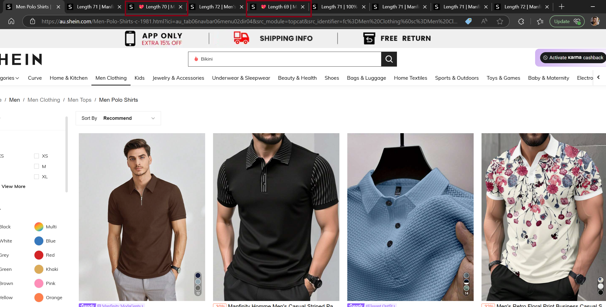

# Shein Size Filter Hack
- Recommended to use on au.shein.com
# Features:
- This script detects the length of the clothing item (e.g. Shirt or dress) and shows in the title of the tab.
- The default script check the length for "Medium" Size and shows a heart 💖 emoji if the length is udner 70 cm (my ideal lenght for a medium shirt)
- Both of the parameters (size type and length threshold) can easily be modified from the script
# Demo (Screenshot):

 

# Creators
- [Hammad Arif](https://github.com/hammadbinarif)
# Install:
- Userscript: [DOWNLOAD](https://github.com/hammadbinarif/shein-sizefilter/raw/master/shein-size-filter.user.js)
- Userscript Manager: [DOWNLOAD](https://tampermonkey.net)
# Instructions:
- 1) Install a browser extension for TamperMonkey Userscript Manager(download above)
- 2) Install the userscript(download above)
- 3) Browse [au.shein.com](https://au.shein.com/) and start opening tabs for the clothes that you shortlist. 

